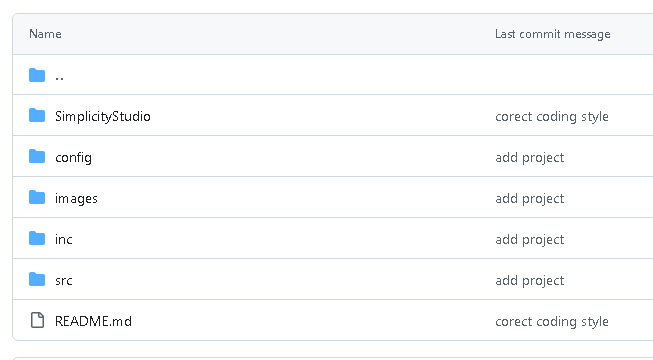
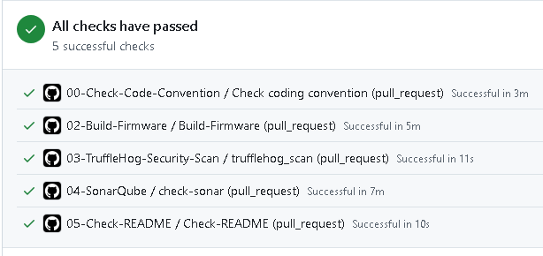
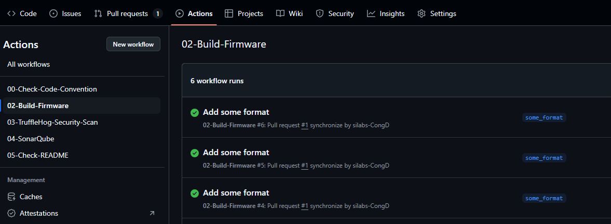
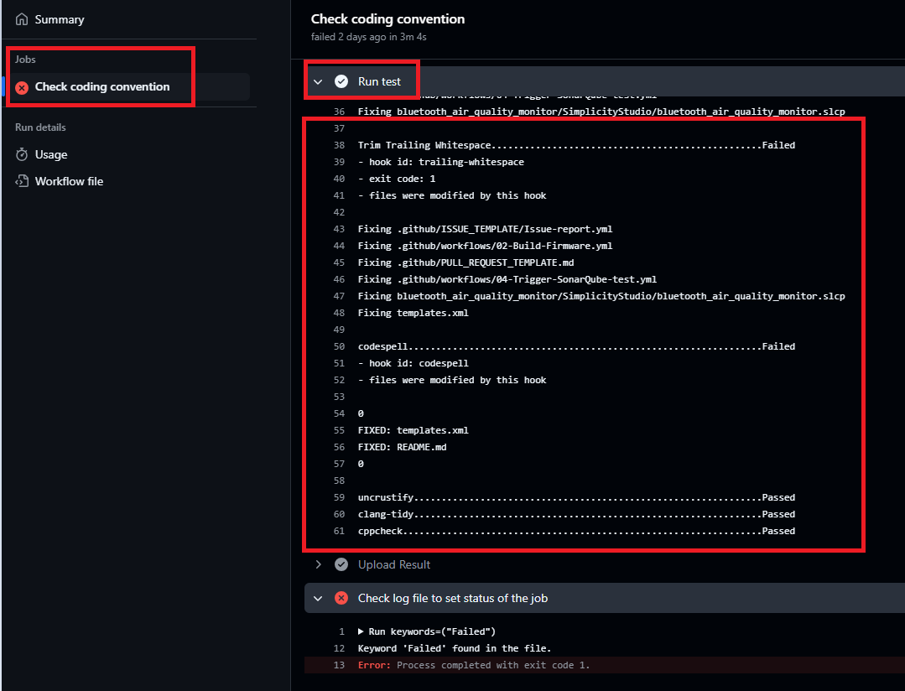
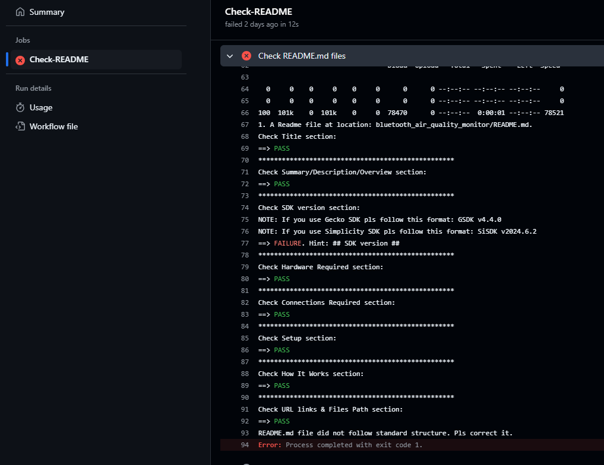
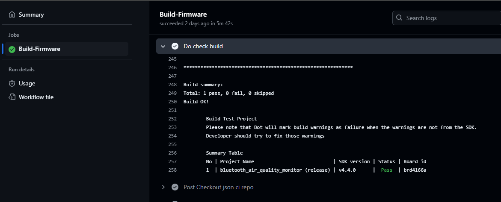
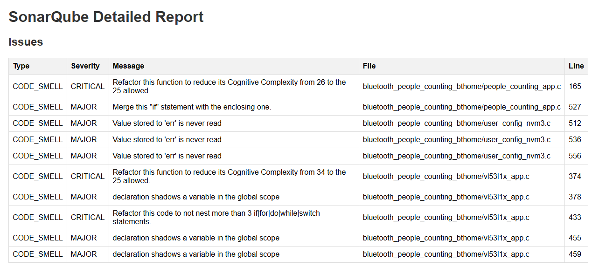

Project guideline

## Structure of projects

Suported project type: .sls or .slcp

SimplicityStudio: Save project file .slcp or .sls

inc: Header file (.h, etc)

src: All sorce .c, .cpp files

## CI-Bot checking

Github repos with use CI/CD system to automatic checking your pull request:

Check coding style, README.md file, build firmware and check coding quality use SonarQube tool.

If any Github check status failure, please click into that to know the reason and fix it.

Or, you can check all console log by this way:

### 1. Check Coding style

Using Uncrustify tool to check coding style.

If checking Fail, it will show the details: which files error.

### 2. Check README.md file
   
Please add all necessary title on your README.md file

The list of title need to be added into README.md file

- Overview/Summary
- SDK Version
- Hardware Required
- Connections Required/Hardware Connection
- Setup
- How It Works

Refer to this project: https://github.com/SiliconLabs/bluetooth_applications/tree/master/bluetooth_air_quality_monitor

If all sections existing on README.md file it will be Pass.

#### 2.1 SDK version

Please follow format if you use Gecko Sdk or Simplicity SDK

If you use Gecko SDK pls follow this format: GSDK v4.4.0

If you use Simplicity SDK pls follow this format: SiSDK v2024.6.2

NOTE: Gsdk or SiSDK version is release tag version on github repo (https://github.com/SiliconLabs/simplicity_sdk/tags)

#### 2.2 Check URL Links & Files Path

This section will check all website link, image PATH in README file. If it not existing then Failed.

NOTE: Don't use private link in README file like github _staging or silabs private url. When it be public on github, viewer could not be access into it.

If you list any image file on README.md but on .slcp file you don't add it. It will be failure.

### Build Firmware
   
It will build project and verify that there are no error and no warning in your projects.

NOTE: If you use .slcp format you have to add your project into templates.xml.

If you list some board_id on templates.xml file then don't add fix board_id on .slcp file.

### Check SonarQube

It will check quality of code. If your project did not follow rules this step will be failure. It you give for you a report.

Please fix all issue which listed on the report file.

## Merge Pull request

Condition to merge:

- At lest 2 approve
- All commit check status must success

## Supporter
